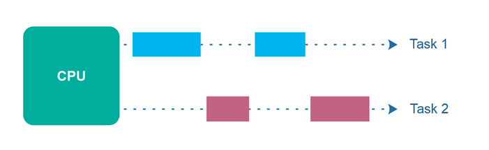
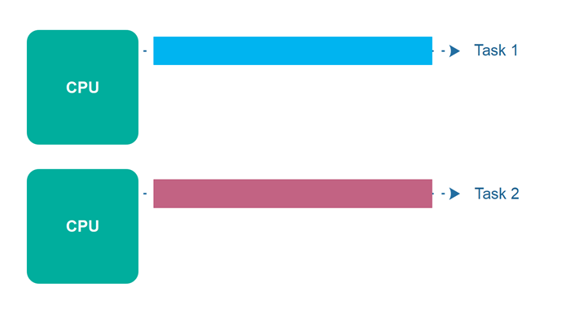
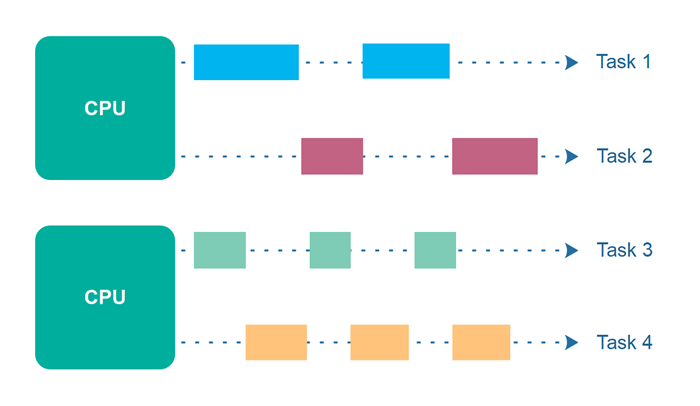
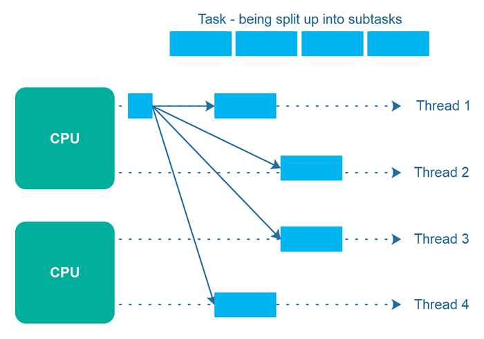

# Concurrency vs. Parallelism

The terms concurrency and parallelism are often used in relation to multithreaded programs. At first it may seem as if concurrency and parallelism may be referring to the same concepts. 

However, concurrency and parallelism actually have different meanings. 

## Concurrent Execution

Concurrency means that an application is making progress on more than one task - at the same time or at least seemingly at the same time (concurrently).

To make progress on more than one task concurrently the CPU switches between the different tasks during execution. This is illustrated in the diagram below:

## Parallel Execution

Parallel execution is when a computer has more than one CPU or CPU core, and makes progress on more than one task simultaneously. **However, parallel execution is not referring to the same phenomenon as parallelism.** 

Parallel execution is illustrated below:

## Parallel Concurrent Execution

It is possible to have parallel concurrent execution, where threads are distributed among multiple CPUs. Thus, the threads executed on the same CPU are executed concurrently, whereas threads executed on different CPUs are executed in parallel. 

The diagram below illustrates parallel concurrent execution.

## Parallelism

The term **parallelism means that an application splits its tasks up into smaller subtasks which can be processed in parallel, for instance on multiple CPUs at the exact same time**. Thus, parallelism does not refer to the same execution model as parallel concurrent execution - even if they may look similar on the surface.

To achieve true parallelism your application must have more than one thread running - and each thread must run on separate CPUs / CPU cores / graphics card GPU cores or similar.

The diagram below illustrates a bigger task which is being split up into 4 subtasks. These 4 subtasks are being executed by 4 different threads, which run on 2 different CPUs. This means, that parts of these subtasks are executed concurrently (those executed on the same CPU), and parts are executed in parallel (those executed on different CPUs).

If instead the 4 subtasks were executed by 4 threads running on each their own CPU (4 CPUs in total), then the task execution would have been fully parallel. However, it is not always easy to break a task into exactly as many subtasks as the number of CPUs available. Often, it is easier to break a task into a number of subtasks which fit naturally with the task at hand, and then let the thread scheduler take care of distributing the threads among the available CPUs.